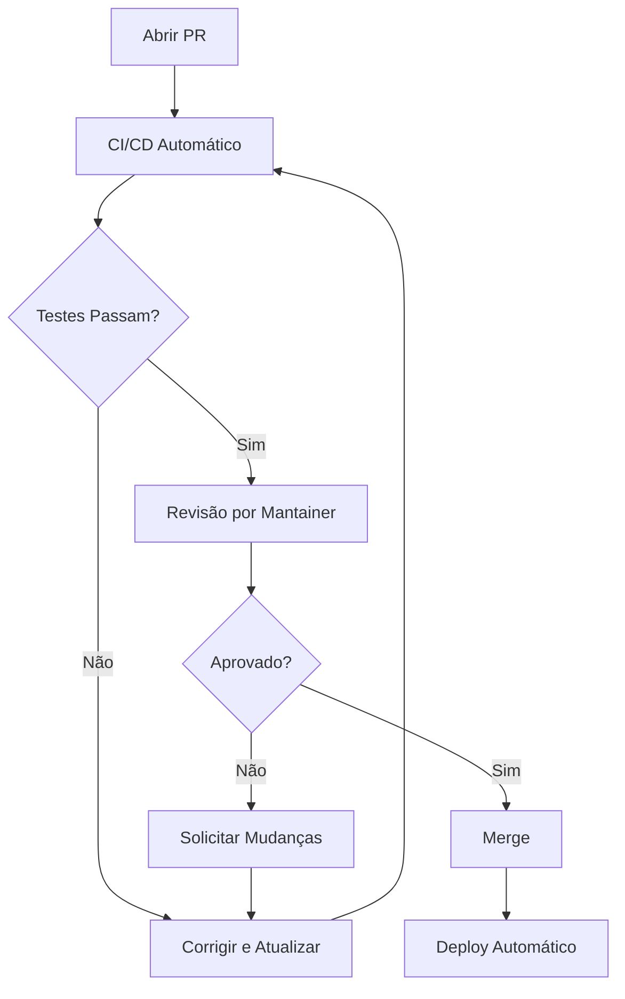

# Processo de Review

Como funciona a revisão de Pull Requests no OitoPorOito.

## Visão Geral

O processo de review garante qualidade, consistência e alinhamento com os objetivos do projeto.

## Fluxo de Review



## Tipos de Review

### 1. Review Automático (CI/CD)

Executado automaticamente em cada PR:

**Checks:**
- ✅ Build compila sem erros
- ✅ Todos os testes passam
- ✅ Linting sem erros
- ✅ Coverage não diminui
- ✅ Bundle size não aumenta significativamente

**Ferramentas:**
- GitHub Actions
- ESLint
- Prettier
- Vitest
- Bundlesize

### 2. Review por Pares

Realizado por maintainers do projeto:

**O que reviewers avaliam:**

#### Funcionalidade
- ✅ Código faz o que promete
- ✅ Edge cases tratados
- ✅ Sem quebrar funcionalidades existentes

#### Qualidade do Código
- ✅ Legível e compreensível
- ✅ Segue guia de estilo
- ✅ Sem duplicação desnecessária
- ✅ Nomes descritivos

#### Arquitetura
- ✅ Estrutura apropriada
- ✅ Componentes reutilizáveis
- ✅ Separação de responsabilidades

#### Testes
- ✅ Testes adequados incluídos
- ✅ Casos importantes cobertos
- ✅ Testes são legíveis

#### Performance
- ✅ Sem operações custosas desnecessárias
- ✅ Renderizações otimizadas
- ✅ Memoização quando apropriado

#### Segurança
- ✅ Input validation
- ✅ Sem XSS vulnerabilities
- ✅ Secrets não expostos

#### Documentação
- ✅ README atualizado se necessário
- ✅ JSDoc em funções complexas
- ✅ Comments onde apropriado

## Timeline Esperado

| Tipo de PR | Tempo de Primeira Resposta | Tempo até Merge |
|------------|---------------------------|-----------------|
| **Typo/Docs** | 1-2 dias | 2-3 dias |
| **Bug simples** | 2-3 dias | 3-5 dias |
| **Feature pequena** | 3-5 dias | 5-10 dias |
| **Feature grande** | 1 semana | 2-4 semanas |

!!! note "Nota"
    Estes são tempos estimados. PRs complexos podem levar mais tempo.

## Estados de Review

### 🔴 Changes Requested

Mudanças são necessárias antes do merge.

**O que fazer:**
1. Leia o feedback cuidadosamente
2. Faça as mudanças solicitadas
3. Responda aos comentários
4. Push das mudanças (PR atualiza automaticamente)
5. Re-solicitar review

```bash
# Após fazer mudanças
git add .
git commit -m "fix: ajustes conforme review"
git push origin sua-branch
```

### 🟡 Commented

Feedback dado, mas não bloqueante.

**O que fazer:**
- Considere as sugestões
- Implemente o que faz sentido
- Responda explicando decisões

### 🟢 Approved

PR aprovado! Pronto para merge.

**Próximos passos:**
- Maintainer faz merge
- Branch pode ser deletada
- Deploy automático inicia

## Respondendo a Feedback

### ✅ Boas Práticas

```markdown
> Suggestion: Use useMemo aqui para otimizar

Boa ideia! Implementei. Commits: abc123

---

> Typo: "recieve" deve ser "receive"

Corrigido. Obrigado!

---

> Pergunta: Por que escolheu este approach?

Considerei X e Y, mas escolhi Z porque [razão].
Se você acha que há uma abordagem melhor, estou aberto!
```

### ❌ Evite

```markdown
> Este código está confuso

Whatever, funciona. ❌

---

> Faltam testes

Muito trabalho, vou fazer depois. ❌

---

> Considere refatorar esta função

Está bom do jeito que está. ❌
```

## Aprovação de PRs

### Quem Pode Aprovar?

- **Maintainers**: Podem aprovar e fazer merge
- **Contributors ativos**: Review é apreciado mas não suficiente

### Critérios de Aprovação

Um PR é aprovado quando:

1. ✅ **CI passa**: Todos os checks automáticos
2. ✅ **Review aprovado**: Pelo menos 1 maintainer
3. ✅ **Conflitos resolvidos**: Sem merge conflicts
4. ✅ **Discussões resolvidas**: Todos os comentários endereçados

## Merge

### Estratégia

OitoPorOito usa **Squash and Merge**:

```
feature/nova-funcionalidade (10 commits)
    ⬇️ Squash
main (1 commit limpo)
```

**Vantagens:**
- Histórico limpo
- Cada feature = 1 commit
- Facilita rollback

### Após o Merge

1. **Branch deletada**: Automaticamente após merge
2. **Deploy**: CI/CD faz deploy para staging
3. **Notificação**: Contribuidor é notificado
4. **Crédito**: Aparece em CONTRIBUTORS.md

## Lidar com Mudanças Solicitadas

### Exemplo de Feedback

```markdown
**Changes Requested por @maintainer**

1. Adicionar testes para função `calculateRating()`
2. Extrair lógica duplicada em função reutilizável
3. Atualizar documentação com novo parâmetro
```

### Como Responder

#### 1. Fazer as Mudanças

```bash
# Implementar mudanças
git add .
git commit -m "test: adiciona testes para calculateRating"
git commit -m "refactor: extrai lógica duplicada"
git commit -m "docs: atualiza documentação"
git push origin feature/rating-system
```

#### 2. Responder aos Comentários

```markdown
✅ 1. Testes adicionados - commit abc123
✅ 2. Refatorado - commit def456  
✅ 3. Docs atualizadas - commit ghi789

Pronto para re-review!
```

#### 3. Re-solicitar Review

Click "Re-request review" no GitHub.

## Resolver Conflitos

Se sua branch tem conflitos com `main`:

```bash
# Atualizar main local
git checkout main
git pull origin main

# Voltar para sua branch
git checkout sua-branch

# Rebase (recomendado)
git rebase main

# Ou merge (alternativa)
git merge main

# Resolver conflitos manualmente
# Depois:
git add .
git rebase --continue
# ou
git commit

# Force push (necessário após rebase)
git push origin sua-branch --force-with-lease
```

## Review de PRs Grandes

Para PRs com muitas mudanças:

### Como Autor

1. **Divida se possível**: Múltiplos PRs menores
2. **Explique contexto**: Descrição detalhada
3. **Destaque áreas chave**: Onde focar review
4. **Oferece walkthrough**: Video ou call se necessário

### Como Reviewer

1. **Peça divisão**: Se muito grande
2. **Review incremental**: Uma área por vez
3. **Foque no importante**: Lógica > style pequenos
4. **Marque como viewed**: Arquivos já revisados

## Auto-Review

Antes de pedir review, faça seu próprio:

### Checklist

- [ ] Li o diff completo
- [ ] Testei localmente
- [ ] Verifiquei console (sem warnings)
- [ ] Rodei testes
- [ ] Checklist do PR preenchido
- [ ] Descrição é clara
- [ ] Screenshots se aplicável

### Ferramentas

```bash
# Ver mudanças
git diff main...sua-branch

# Review no GitHub
# Use "Files changed" tab antes de pedir review
```

## Etiqueta

### ✅ Faça

- Seja respeitoso e construtivo
- Elogie bom código
- Explique o "porquê" das sugestões
- Ofereça soluções, não só problemas
- Use "nit:" para sugestões não-bloqueantes

### ❌ Evite

- Críticas pessoais
- Ser condescendente
- Bike-shedding (debater detalhes triviais)
- Aprovar sem ler
- Bloquear sem razão

## Exemplos de Comentários

### Bons Comentários

```markdown
💡 Consider using `useMemo` here to avoid recalculating on every render:

```js
const validMoves = useMemo(() => {
  return chess.moves();
}, [position]);
```

This would improve performance, especially for complex positions.

---

🎉 Nice implementation of the rating system! Clean and well-tested.

nit: Could add a JSDoc comment explaining the algorithm.

---

❓ Why did you choose `useReducer` instead of `useState` here?

Just curious about the reasoning.
```

### Comentários a Melhorar

```markdown
❌ This is wrong. ← Não explica porquê

❌ Por que você não fez X? ← Tom acusatório

❌ Isso é muito complexo, simplifique. ← Não oferece solução

✅ This logic is a bit complex. What do you think about
   extracting it to a separate function? Something like:
   
   function validateMove(from, to) {
     // logic here
   }
   
   Would make it more testable too!
```

## Recursos

- [Como fazer um bom code review](https://google.github.io/eng-practices/review/)
- [Conventional Comments](https://conventionalcomments.org/)
- [GitHub Review Guide](https://docs.github.com/en/pull-requests/collaborating-with-pull-requests/reviewing-changes-in-pull-requests)

## Contato

Dúvidas sobre o processo de review?

- 💬 [GitHub Discussions](https://github.com/orgs/Oito-Por-Oito/discussions)
- 📧 Email: dev@oitoporoito.com
- 💡 [Como Contribuir](how-to-contribute.md)
