# Deployment - Visão Geral

Guia completo para fazer deploy do OitoPorOito em produção.

## Arquitetura de Deploy

```mermaid
graph TB
    Users[Usuários] --> CDN[CloudFlare CDN]
    CDN --> Frontend[Frontend - Vercel]
    Frontend --> Supabase[Supabase]
    Supabase --> DB[(PostgreSQL)]
    Supabase --> Storage[Storage S3]
    Frontend --> Analytics[Analytics]
```



## Stack de Produção

### Frontend
- **Hosting**: Vercel, Netlify ou CloudFlare Pages
- **CDN**: Automático via plataforma
- **SSL**: Certificado automático (Let's Encrypt)

### Backend
- **BaaS**: Supabase Cloud
- **Database**: PostgreSQL (gerenciado)
- **Storage**: Supabase Storage
- **Auth**: Supabase Auth

### Monitoramento
- **Errors**: Sentry
- **Analytics**: Google Analytics / Plausible
- **Performance**: Vercel Analytics

## Pré-requisitos

### Contas Necessárias

1. **GitHub** (grátis)
   - Para versionamento
   - CI/CD automático

2. **Vercel** (grátis para hobby)
   - Deploy do frontend
   - [vercel.com](https://vercel.com)

3. **Supabase** (grátis até 500MB)
   - Backend e database
   - [supabase.com](https://supabase.com)

4. **CloudFlare** (opcional, grátis)
   - DNS e CDN
   - [cloudflare.com](https://cloudflare.com)

### Ferramentas

```bash
# Vercel CLI
npm install -g vercel

# Supabase CLI
npm install -g supabase

# GitHub CLI (opcional)
npm install -g gh
```

## Checklist de Deploy

### ✅ Pré-Deploy

- [ ] Todos os testes passando
- [ ] Build de produção sem erros
- [ ] Variáveis de ambiente configuradas
- [ ] Database migrations aplicadas
- [ ] RLS policies configuradas
- [ ] Domínio comprado (se custom)

### ✅ Durante Deploy

- [ ] Deploy do backend (Supabase)
- [ ] Deploy do frontend (Vercel) 
- [ ] Configurar DNS
- [ ] Testar ambiente de produção
- [ ] Configurar monitoramento

### ✅ Pós-Deploy

- [ ] Smoke tests
- [ ] Performance check
- [ ] SEO verificado
- [ ] Analytics configurado
- [ ] Backup configurado
- [ ] Documentação atualizada

## Variáveis de Ambiente

### Desenvolvimento (`.env.development`)

```ini
VITE_SUPABASE_URL=https://dev-project.supabase.co
VITE_SUPABASE_ANON_KEY=dev-key
VITE_APP_URL=http://localhost:5173
VITE_DEBUG=true
```

### Produção (`.env.production`)

```ini
VITE_SUPABASE_URL=https://prod-project.supabase.co
VITE_SUPABASE_ANON_KEY=prod-key
VITE_APP_URL=https://oitoporoito.com
VITE_DEBUG=false
VITE_GA_ID=G-XXXXXXXXXX
VITE_SENTRY_DSN=https://...
```

!!! warning "Segurança"
    - Nunca commite `.env` files
    - Use secrets management
    - Rotacione keys regularmente

## CI/CD Pipeline

### GitHub Actions

Arquivo `.github/workflows/deploy.yml`:

```yaml
name: Deploy

on:
  push:
    branches: [main]

jobs:
  test:
    runs-on: ubuntu-latest
    steps:
      - uses: actions/checkout@v3
      - uses: actions/setup-node@v3
        with:
          node-version: 20
      - run: npm ci
      - run: npm test
      - run: npm run build

  deploy:
    needs: test
    runs-on: ubuntu-latest
    steps:
      - uses: actions/checkout@v3
      - uses: amondnet/vercel-action@v20
        with:
          vercel-token: ${{ secrets.VERCEL_TOKEN }}
          vercel-org-id: ${{ secrets.ORG_ID }}
          vercel-project-id: ${{ secrets.PROJECT_ID }}
```

## Ambientes

### Development

```
https://dev.oitoporoito.com
```

- Branch: `develop`
- Auto-deploy em cada push
- Dados de teste

### Staging

```
https://staging.oitoporoito.com
```

- Branch: `staging`
- Testes finais
- Dados similares à produção

### Production

```
https://oitoporoito.com
```

- Branch: `main`
- Deploy manual ou após aprovação
- Dados reais

## Performance

### Otimizações

```javascript
// vite.config.js
export default {
  build: {
    rollupOptions: {
      output: {
        manualChunks: {
          'react-vendor': ['react', 'react-dom'],
          'chess-vendor': ['chess.js', 'stockfish.wasm'],
        }
      }
    }
  }
}
```

### Compressão

```javascript
// vercel.json
{
  "headers": [
    {
      "source": "/(.*)",
      "headers": [
        {
          "key": "X-Content-Type-Options",
          "value": "nosniff"
        },
        {
          "key": "X-Frame-Options",
          "value": "DENY"
        }
      ]
    }
  ]
}
```

### Cache

```javascript
// vercel.json
{
  "headers": [
    {
      "source": "/assets/(.*)",
      "headers": [
        {
          "key": "Cache-Control",
          "value": "public, max-age=31536000, immutable"
        }
      ]
    }
  ]
}
```

## Monitoramento

### Sentry (Errors)

```javascript
// src/main.jsx
import * as Sentry from "@sentry/react";

Sentry.init({
  dsn: import.meta.env.VITE_SENTRY_DSN,
  environment: import.meta.env.MODE,
  tracesSampleRate: 0.1,
});
```

### Analytics

```javascript
// Google Analytics
import ReactGA from 'react-ga4';

ReactGA.initialize(import.meta.env.VITE_GA_ID);

// Track page views
const trackPageView = (path) => {
  ReactGA.send({ hitType: "pageview", page: path });
};
```

## Backup

### Database

```bash
# Backup manual
pg_dump -h db.xxx.supabase.co -U postgres > backup.sql

# Automático via Supabase
# Backups diários retidos por 7 dias (free tier)
```

### Storage

```bash
# Backup de arquivos
supabase storage sync download bucket-name ./backup
```

## Rollback

Se algo der errado:

### Vercel

```bash
# Via CLI
vercel rollback

# Via Dashboard
# Vercel > Project > Deployments > ... > Rollback
```

### Supabase

```bash
# Restore database
psql -h db.xxx.supabase.co -U postgres < backup.sql
```

## Domínio Customizado

### Configurar DNS

```
# A Record
@  A  76.76.21.21

# CNAME
www  CNAME  cname.vercel-dns.com
```

### SSL

Automático via Vercel após configurar DNS (5-10 minutos).

## Health Checks

### Endpoint

```javascript
// src/pages/api/health.js
export async function handler(req, res) {
  const supabaseHealthy = await checkSupabase();
  
  res.status(supabaseHealthy ? 200 : 503).json({
    status: supabaseHealthy ? 'healthy' : 'unhealthy',
    timestamp: new Date().toISOString(),
    services: {
      supabase: supabaseHealthy
    }
  });
}
```

### Monitoramento

Use [UptimeRobot](https://uptimerobot.com/) ou similar:

```
URL: https://oitoporoito.com/api/health
Interval: 5 minutes
```

## Custos Estimados

### Tier Gratuito

| Serviço | Limites | Custo |
|---------|---------|-------|
| Vercel | 100GB bandwidth | $0 |
| Supabase | 500MB DB, 1GB storage | $0 |
| CloudFlare | Ilimitado | $0 |
| **Total** | | **$0/mês** |

### Tier Pago (Estimado)

| Serviço | Plano | Custo |
|---------|-------|-------|
| Vercel | Pro | $20/mês |
| Supabase | Pro | $25/mês |
| Sentry | Developer | $26/mês |
| Domínio | .com | $12/ano |
| **Total** | | **~$72/mês** |

## Troubleshooting

### Build Falha

```bash
# Limpar cache
rm -rf node_modules .next dist
npm install
npm run build
```

### Variáveis de Ambiente

```bash
# Verificar no Vercel
vercel env ls

# Adicionar
vercel env add VITE_SUPABASE_URL production
```

### SSL Não Funciona

- Aguarde 10-15 minutos
- Verifique configuração DNS
- Force renovação no dashboard

## Próximos Passos

- 🚀 [Guia de Desenvolvimento](../development/getting-started.md)
- ⚙️ [Configuração](../development/configuration.md)

---

**Pronto para fazer deploy!** 🎉
