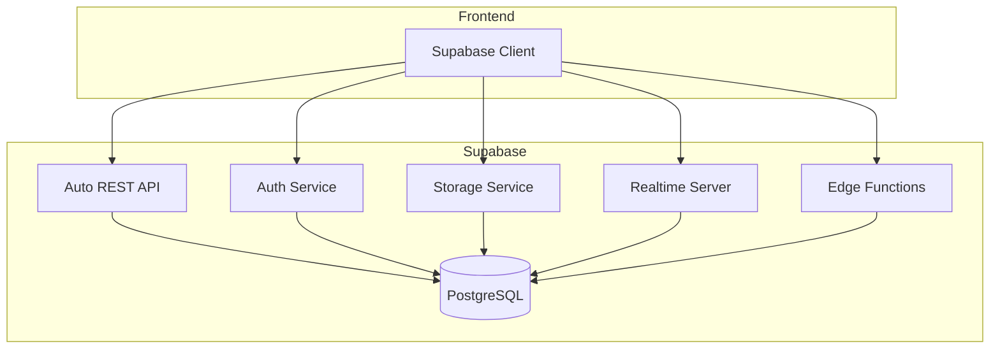

# Arquitetura Backend

## Visão Geral

O backend do OitoPorOito é powered by **Supabase**, uma plataforma Backend-as-a-Service (BaaS) construída sobre PostgreSQL. Supabase fornece uma API REST automática, autenticação, armazenamento de arquivos e subscriptions em tempo real.

## Por que Supabase?

### Vantagens

✅ **Open Source**: Código aberto e auto-hostável  
✅ **PostgreSQL**: Banco de dados robusto e SQL completo  
✅ **API Automática**: REST API gerada a partir do schema  
✅ **Realtime**: Subscriptions WebSocket para dados em tempo real  
✅ **Auth Built-in**: Sistema completo de autenticação  
✅ **Storage**: Armazenamento de arquivos S3-compatible  
✅ **Row Level Security**: Segurança no nível de linha  
✅ **Edge Functions**: Serverless functions (Deno)  

### Comparações

| Recurso | Supabase | Firebase | Custom API |
|---------|----------|----------|------------|
| Open Source | ✅ | ❌ | ✅ |
| SQL | ✅ | ❌ | ✅ |
| Self-hosted | ✅ | ❌ | ✅ |
| Realtime | ✅ | ✅ | 🔶 |
| Auto API | ✅ | ✅ | ❌ |
| Learning Curve | 🟢 Médio | 🟢 Baixo | 🔴 Alto |

## Arquitetura Supabase



## Componentes do Backend

### 1. PostgreSQL Database

**Schema Principal:**

```sql
-- Usuários (gerenciado pelo Supabase Auth)
auth.users
  - id: uuid (PK)
  - email: text
  - created_at: timestamp

-- Perfis de usuário
public.profiles
  - id: uuid (PK, FK -> auth.users)
  - username: text
  - avatar_url: text
  - rating: integer
  - created_at: timestamp

-- Partidas
public.games
  - id: uuid (PK)
  - white_player_id: uuid (FK -> auth.users)
  - black_player_id: uuid (FK -> auth.users)
  - pgn: text
  - result: text
  - time_control: text
  - created_at: timestamp

-- Movimentos
public.moves
  - id: uuid (PK)
  - game_id: uuid (FK -> games)
  - move_number: integer
  - white_move: text
  - black_move: text
  - position_fen: text

-- Puzzles
public.puzzles
  - id: uuid (PK)
  - fen: text
  - moves: text[]
  - rating: integer
  - themes: text[]
  - created_at: timestamp

-- Soluções de puzzles
public.puzzle_attempts
  - id: uuid (PK)
  - user_id: uuid (FK -> auth.users)
  - puzzle_id: uuid (FK -> puzzles)
  - solved: boolean
  - time_spent: integer
  - created_at: timestamp

-- Amizades
public.friendships
  - id: uuid (PK)
  - user_id: uuid (FK -> auth.users)
  - friend_id: uuid (FK -> auth.users)
  - status: text (pending, accepted, rejected)
  - created_at: timestamp

-- Clubes
public.clubs
  - id: uuid (PK)
  - name: text
  - description: text
  - owner_id: uuid (FK -> auth.users)
  - created_at: timestamp

-- Membros de clubes
public.club_members
  - id: uuid (PK)
  - club_id: uuid (FK -> clubs)
  - user_id: uuid (FK -> auth.users)
  - role: text (admin, member)
  - joined_at: timestamp
```

### 2. Authentication

Supabase Auth fornece:

**Métodos de Autenticação:**
- Email/Password
- Magic Links
- OAuth2 (Google, GitHub, etc.)
- Phone/SMS

**Recursos:**
- JWT tokens
- Refresh tokens
- Session management
- Password reset
- Email verification

**Exemplo de Uso:**

```javascript
// Cliente no frontend
import { createClient } from '@supabase/supabase-js';

const supabase = createClient(SUPABASE_URL, SUPABASE_KEY);

// Signup
const { data, error } = await supabase.auth.signUp({
  email: 'user@example.com',
  password: 'password123'
});

// Login
const { data, error } = await supabase.auth.signInWithPassword({
  email: 'user@example.com',
  password: 'password123'
});

// Logout
await supabase.auth.signOut();

// Obter usuário atual
const { data: { user } } = await supabase.auth.getUser();
```

### 3. Row Level Security (RLS)

Políticas de segurança no nível de linha garantem que usuários só acessem dados apropriados:

```sql
-- Usuários só podem ver seu próprio perfil
CREATE POLICY "Users can view own profile"
ON profiles FOR SELECT
USING (auth.uid() = id);

-- Usuários podem atualizar seu próprio perfil
CREATE POLICY "Users can update own profile"
ON profiles FOR UPDATE
USING (auth.uid() = id);

-- Qualquer um pode ver partidas públicas
CREATE POLICY "Public games are viewable"
ON games FOR SELECT
USING (true);

-- Apenas jogadores podem atualizar suas partidas
CREATE POLICY "Players can update their games"
ON games FOR UPDATE
USING (
  auth.uid() = white_player_id OR 
  auth.uid() = black_player_id
);
```

### 4. Storage

Armazenamento de arquivos para:
- Avatares de usuários
- Imagens de eventos
- Exports de partidas (PGN)

**Buckets:**
- `avatars`: Fotos de perfil (público)
- `club-images`: Imagens de clubes (público)
- `games`: Exports de partidas (privado)

**Exemplo:**

```javascript
// Upload de avatar
const { data, error } = await supabase.storage
  .from('avatars')
  .upload(`${userId}/avatar.png`, file);

// Obter URL pública
const { data } = supabase.storage
  .from('avatars')
  .getPublicUrl(`${userId}/avatar.png`);
```

### 5. Realtime Subscriptions

Atualizações em tempo real para:
- Movimentos de partidas ativas
- Notificações
- Chat de clubes
- Status online de amigos

**Exemplo:**

```javascript
// Subscrever a uma partida
const channel = supabase
  .channel(`game:${gameId}`)
  .on(
    'postgres_changes',
    {
      event: 'INSERT',
      schema: 'public',
      table: 'moves',
      filter: `game_id=eq.${gameId}`
    },
    (payload) => {
      console.log('Novo movimento:', payload.new);
      updateBoard(payload.new);
    }
  )
  .subscribe();

// Cleanup
channel.unsubscribe();
```

### 6. Edge Functions (Futuro)

Serverless functions para lógica customizada:

- **Matchmaking**: Encontrar oponentes compatíveis
- **Rating Calculation**: Calcular ELO/Glicko
- **Notifications**: Enviar emails/push
- **Webhooks**: Integrar com serviços externos

```typescript
// supabase/functions/calculate-rating/index.ts
import { serve } from "https://deno.land/std@0.168.0/http/server.ts";

serve(async (req) => {
  const { gameId } = await req.json();
  
  // Lógica de cálculo de rating
  const newRatings = calculateElo(whiteRating, blackRating, result);
  
  return new Response(
    JSON.stringify(newRatings),
    { headers: { "Content-Type": "application/json" } }
  );
});
```

## Queries Comuns

### Buscar Perfil de Usuário

```javascript
const { data, error } = await supabase
  .from('profiles')
  .select('*')
  .eq('id', userId)
  .single();
```

### Buscar Partidas de um Usuário

```javascript
const { data, error } = await supabase
  .from('games')
  .select('*, profiles!white_player_id(*), profiles!black_player_id(*)')
  .or(`white_player_id.eq.${userId},black_player_id.eq.${userId}`)
  .order('created_at', { ascending: false })
  .limit(10);
```

### Criar Nova Partida

```javascript
const { data, error } = await supabase
  .from('games')
  .insert({
    white_player_id: user1Id,
    black_player_id: user2Id,
    time_control: '10+0',
    pgn: ''
  })
  .select()
  .single();
```

### Buscar Amigos

```javascript
const { data, error } = await supabase
  .from('friendships')
  .select('friend:profiles!friend_id(*)')
  .eq('user_id', userId)
  .eq('status', 'accepted');
```

## Backup e Recovery

### Backup Automático
Supabase Cloud oferece:
- Backups diários automáticos
- Point-in-time recovery (PITR)
- Retenção de 7 dias (plano free)

### Backup Manual
```bash
# Export do banco
pg_dump -h db.xxx.supabase.co -U postgres > backup.sql

# Restore
psql -h db.xxx.supabase.co -U postgres < backup.sql
```

## Monitoramento

Supabase Dashboard fornece:
- Logs de queries
- Performance metrics
- API usage
- Error tracking
- Slow query analysis

## Limitações e Considerações

### Plano Free
- 500 MB de database
- 1 GB de Storage
- 2 GB de bandwidth
- Row Level Security habilitado

### Escalabilidade
- Upgrade para planos pagos conforme crescimento
- Ou migrar para self-hosted
- PostgreSQL escala bem verticalmente

## Self-Hosting (Opcional)

Para controle total, é possível hospedar Supabase:

```bash
# Clone do repo
git clone https://github.com/supabase/supabase
cd supabase/docker

# Configurar
cp .env.example .env

# Subir serviços
docker-compose up -d
```

## Migração de Dados

Migrações SQL versionadas:

```sql
-- migrations/001_create_profiles.sql
CREATE TABLE profiles (
  id UUID REFERENCES auth.users PRIMARY KEY,
  username TEXT UNIQUE NOT NULL,
  rating INTEGER DEFAULT 1500,
  created_at TIMESTAMP DEFAULT NOW()
);
```

## Próximos Passos

- 💾 [Banco de Dados Detalhado](database.md)
- � [Deploy](../../deployment/overview.md)
