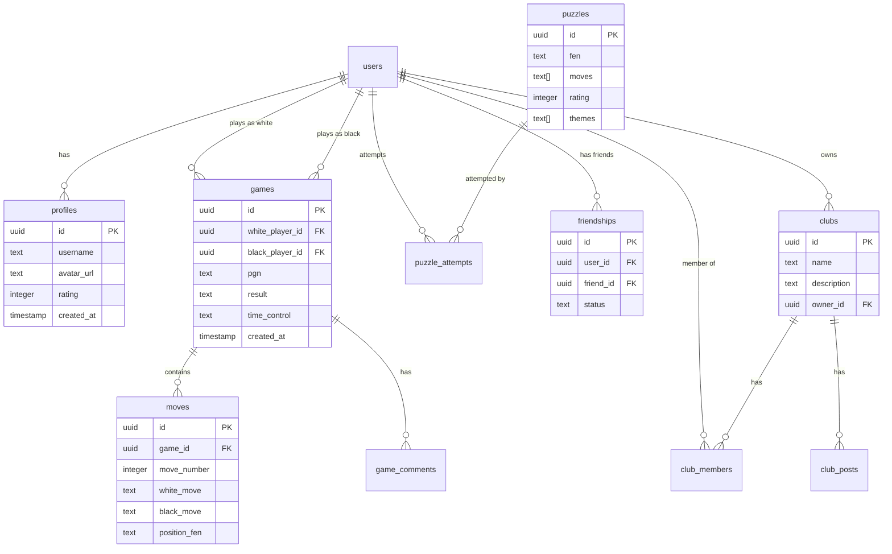

# Banco de Dados

## Visão Geral

O OitoPorOito utiliza **PostgreSQL** como sistema de gerenciamento de banco de dados, gerenciado através do Supabase. O schema é projetado para suportar todas as funcionalidades da plataforma de xadrez, incluindo partidas, puzzles, social e rankings.

## Diagrama ER



## Schema Completo

### Tabela: profiles

Perfis estendidos dos usuários.

```sql
CREATE TABLE profiles (
    id UUID REFERENCES auth.users ON DELETE CASCADE PRIMARY KEY,
    username TEXT UNIQUE NOT NULL,
    full_name TEXT,
    avatar_url TEXT,
    bio TEXT,
    country TEXT,
    rating INTEGER DEFAULT 1500,
    puzzle_rating INTEGER DEFAULT 1500,
    title TEXT, -- GM, IM, FM, CM, NM
    is_online BOOLEAN DEFAULT false,
    last_seen TIMESTAMP,
    created_at TIMESTAMP DEFAULT NOW(),
    updated_at TIMESTAMP DEFAULT NOW(),
    
    CONSTRAINT username_length CHECK (char_length(username) >= 3)
);

-- Índices
CREATE INDEX idx_profiles_username ON profiles(username);
CREATE INDEX idx_profiles_rating ON profiles(rating DESC);
CREATE INDEX idx_profiles_online ON profiles(is_online);

-- RLS Policies
ALTER TABLE profiles ENABLE ROW LEVEL SECURITY;

CREATE POLICY "Public profiles are viewable by everyone"
ON profiles FOR SELECT
USING (true);

CREATE POLICY "Users can update own profile"
ON profiles FOR UPDATE
USING (auth.uid() = id);
```

### Tabela: games

Partidas de xadrez entre jogadores.

```sql
CREATE TABLE games (
    id UUID PRIMARY KEY DEFAULT uuid_generate_v4(),
    white_player_id UUID REFERENCES auth.users NOT NULL,
    black_player_id UUID REFERENCES auth.users NOT NULL,
    pgn TEXT NOT NULL DEFAULT '',
    fen TEXT,
    result TEXT, -- 1-0, 0-1, 1/2-1/2
    result_reason TEXT, -- checkmate, resign, timeout, draw, stalemate
    time_control TEXT NOT NULL, -- 1+0, 3+0, 5+0, 10+0, 15+10, 30+0
    white_rating INTEGER,
    black_rating INTEGER,
    white_rating_change INTEGER,
    black_rating_change INTEGER,
    status TEXT DEFAULT 'active', -- active, finished, aborted
    started_at TIMESTAMP,
    finished_at TIMESTAMP,
    created_at TIMESTAMP DEFAULT NOW(),
    
    CONSTRAINT different_players CHECK (white_player_id != black_player_id)
);

-- Índices
CREATE INDEX idx_games_white_player ON games(white_player_id);
CREATE INDEX idx_games_black_player ON games(black_player_id);
CREATE INDEX idx_games_status ON games(status);
CREATE INDEX idx_games_created_at ON games(created_at DESC);

-- RLS Policies
ALTER TABLE games ENABLE ROW LEVEL SECURITY;

CREATE POLICY "Games are viewable by everyone"
ON games FOR SELECT
USING (true);

CREATE POLICY "Players can update their active games"
ON games FOR UPDATE
USING (
    status = 'active' AND
    (auth.uid() = white_player_id OR auth.uid() = black_player_id)
);
```

### Tabela: moves

Movimentos individuais de cada partida.

```sql
CREATE TABLE moves (
    id UUID PRIMARY KEY DEFAULT uuid_generate_v4(),
    game_id UUID REFERENCES games ON DELETE CASCADE NOT NULL,
    move_number INTEGER NOT NULL,
    white_move TEXT,
    white_time_left INTEGER, -- milissegundos
    black_move TEXT,
    black_time_left INTEGER,
    position_fen TEXT NOT NULL,
    created_at TIMESTAMP DEFAULT NOW(),
    
    CONSTRAINT positive_move_number CHECK (move_number > 0)
);

-- Índices
CREATE INDEX idx_moves_game_id ON moves(game_id);
CREATE INDEX idx_moves_game_move ON moves(game_id, move_number);

-- RLS Policies
ALTER TABLE moves ENABLE ROW LEVEL SECURITY;

CREATE POLICY "Moves are viewable by everyone"
ON moves FOR SELECT
USING (true);
```

### Tabela: puzzles

Problemas táticos de xadrez.

```sql
CREATE TABLE puzzles (
    id UUID PRIMARY KEY DEFAULT uuid_generate_v4(),
    fen TEXT NOT NULL,
    moves TEXT[] NOT NULL, -- ['e2e4', 'e7e5', ...]
    rating INTEGER NOT NULL,
    themes TEXT[] NOT NULL, -- ['fork', 'pin', 'mate-in-2']
    popularity INTEGER DEFAULT 0,
    nb_plays INTEGER DEFAULT 0,
    solution_rate DECIMAL(5,2), -- % de acerto
    created_at TIMESTAMP DEFAULT NOW(),
    
    CONSTRAINT valid_rating CHECK (rating BETWEEN 100 AND 3000),
    CONSTRAINT valid_solution_rate CHECK (solution_rate >= 0 AND solution_rate <= 100)
);

-- Índices
CREATE INDEX idx_puzzles_rating ON puzzles(rating);
CREATE INDEX idx_puzzles_themes ON puzzles USING GIN(themes);
CREATE INDEX idx_puzzles_popularity ON puzzles(popularity DESC);

-- RLS Policies
ALTER TABLE puzzles ENABLE ROW LEVEL SECURITY;

CREATE POLICY "Puzzles are viewable by everyone"
ON puzzles FOR SELECT
USING (true);
```

### Tabela: puzzle_attempts

Tentativas de solução de puzzles.

```sql
CREATE TABLE puzzle_attempts (
    id UUID PRIMARY KEY DEFAULT uuid_generate_v4(),
    user_id UUID REFERENCES auth.users NOT NULL,
    puzzle_id UUID REFERENCES puzzles NOT NULL,
    solved BOOLEAN NOT NULL,
    time_spent INTEGER, -- segundos
    moves_made TEXT[],
    rating_change INTEGER,
    created_at TIMESTAMP DEFAULT NOW()
);

-- Índices
CREATE INDEX idx_puzzle_attempts_user ON puzzle_attempts(user_id);
CREATE INDEX idx_puzzle_attempts_puzzle ON puzzle_attempts(puzzle_id);
CREATE INDEX idx_puzzle_attempts_user_puzzle ON puzzle_attempts(user_id, puzzle_id);

-- RLS Policies
ALTER TABLE puzzle_attempts ENABLE ROW LEVEL SECURITY;

CREATE POLICY "Users can view own attempts"
ON puzzle_attempts FOR SELECT
USING (auth.uid() = user_id);

CREATE POLICY "Users can insert own attempts"
ON puzzle_attempts FOR INSERT
WITH CHECK (auth.uid() = user_id);
```

### Tabela: friendships

Relações de amizade entre usuários.

```sql
CREATE TABLE friendships (
    id UUID PRIMARY KEY DEFAULT uuid_generate_v4(),
    user_id UUID REFERENCES auth.users ON DELETE CASCADE NOT NULL,
    friend_id UUID REFERENCES auth.users ON DELETE CASCADE NOT NULL,
    status TEXT NOT NULL DEFAULT 'pending', -- pending, accepted, rejected
    created_at TIMESTAMP DEFAULT NOW(),
    updated_at TIMESTAMP DEFAULT NOW(),
    
    CONSTRAINT different_users CHECK (user_id != friend_id),
    CONSTRAINT unique_friendship UNIQUE(user_id, friend_id)
);

-- Índices
CREATE INDEX idx_friendships_user ON friendships(user_id);
CREATE INDEX idx_friendships_friend ON friendships(friend_id);
CREATE INDEX idx_friendships_status ON friendships(status);

-- RLS Policies
ALTER TABLE friendships ENABLE ROW LEVEL SECURITY;

CREATE POLICY "Users can view own friendships"
ON friendships FOR SELECT
USING (auth.uid() = user_id OR auth.uid() = friend_id);

CREATE POLICY "Users can create friend requests"
ON friendships FOR INSERT
WITH CHECK (auth.uid() = user_id);

CREATE POLICY "Users can update friendship status"
ON friendships FOR UPDATE
USING (auth.uid() = friend_id AND status = 'pending');
```

### Tabela: clubs

Clubes de xadrez.

```sql
CREATE TABLE clubs (
    id UUID PRIMARY KEY DEFAULT uuid_generate_v4(),
    name TEXT NOT NULL,
    description TEXT,
    avatar_url TEXT,
    owner_id UUID REFERENCES auth.users NOT NULL,
    is_public BOOLEAN DEFAULT true,
    member_count INTEGER DEFAULT 1,
    created_at TIMESTAMP DEFAULT NOW(),
    updated_at TIMESTAMP DEFAULT NOW(),
    
    CONSTRAINT name_length CHECK (char_length(name) >= 3)
);

-- Índices
CREATE INDEX idx_clubs_owner ON clubs(owner_id);
CREATE INDEX idx_clubs_public ON clubs(is_public);
CREATE INDEX idx_clubs_member_count ON clubs(member_count DESC);

-- RLS Policies
ALTER TABLE clubs ENABLE ROW LEVEL SECURITY;

CREATE POLICY "Public clubs are viewable by everyone"
ON clubs FOR SELECT
USING (is_public = true OR auth.uid() = owner_id);
```

### Tabela: club_members

Membros de clubes.

```sql
CREATE TABLE club_members (
    id UUID PRIMARY KEY DEFAULT uuid_generate_v4(),
    club_id UUID REFERENCES clubs ON DELETE CASCADE NOT NULL,
    user_id UUID REFERENCES auth.users ON DELETE CASCADE NOT NULL,
    role TEXT NOT NULL DEFAULT 'member', -- owner, admin, member
    joined_at TIMESTAMP DEFAULT NOW(),
    
    CONSTRAINT unique_membership UNIQUE(club_id, user_id)
);

-- Índices
CREATE INDEX idx_club_members_club ON club_members(club_id);
CREATE INDEX idx_club_members_user ON club_members(user_id);

-- RLS Policies
ALTER TABLE club_members ENABLE ROW LEVEL SECURITY;

CREATE POLICY "Club members are viewable by everyone"
ON club_members FOR SELECT
USING (true);

CREATE POLICY "Users can join clubs"
ON club_members FOR INSERT
WITH CHECK (auth.uid() = user_id);
```

## Triggers e Functions

### Atualizar timestamp

```sql
CREATE OR REPLACE FUNCTION update_updated_at_column()
RETURNS TRIGGER AS $$
BEGIN
    NEW.updated_at = NOW();
    RETURN NEW;
END;
$$ language 'plpgsql';

CREATE TRIGGER update_profiles_updated_at
BEFORE UPDATE ON profiles
FOR EACH ROW
EXECUTE FUNCTION update_updated_at_column();
```

### Atualizar member_count

```sql
CREATE OR REPLACE FUNCTION update_club_member_count()
RETURNS TRIGGER AS $$
BEGIN
    IF TG_OP = 'INSERT' THEN
        UPDATE clubs
        SET member_count = member_count + 1
        WHERE id = NEW.club_id;
    ELSIF TG_OP = 'DELETE' THEN
        UPDATE clubs
        SET member_count = member_count - 1
        WHERE id = OLD.club_id;
    END IF;
    RETURN NULL;
END;
$$ language 'plpgsql';

CREATE TRIGGER update_club_member_count_trigger
AFTER INSERT OR DELETE ON club_members
FOR EACH ROW
EXECUTE FUNCTION update_club_member_count();
```

## Views

### View: user_stats

```sql
CREATE VIEW user_stats AS
SELECT
    p.id,
    p.username,
    p.rating,
    COUNT(DISTINCT CASE WHEN g.white_player_id = p.id OR g.black_player_id = p.id THEN g.id END) as total_games,
    COUNT(DISTINCT CASE WHEN (g.white_player_id = p.id AND g.result = '1-0') OR (g.black_player_id = p.id AND g.result = '0-1') THEN g.id END) as wins,
    COUNT(DISTINCT CASE WHEN g.result = '1/2-1/2' THEN g.id END) as draws,
    COUNT(DISTINCT pa.id) as puzzles_attempted,
    COUNT(DISTINCT CASE WHEN pa.solved = true THEN pa.id END) as puzzles_solved
FROM profiles p
LEFT JOIN games g ON g.white_player_id = p.id OR g.black_player_id = p.id
LEFT JOIN puzzle_attempts pa ON pa.user_id = p.id
GROUP BY p.id, p.username, p.rating;
```

## Migrations

As migrações são versionadas e aplicadas sequencialmente:

```bash
migrations/
├── 001_create_profiles.sql
├── 002_create_games.sql
├── 003_create_moves.sql
├── 004_create_puzzles.sql
├── 005_create_friendships.sql
├── 006_create_clubs.sql
└── 007_create_triggers.sql
```

## Backup Strategy

### Automático (Supabase Cloud)
- Backups diários
- Retenção de 7 dias (free tier)
- Point-in-time recovery

### Manual
```bash
# Backup completo
pg_dump -h db.xxx.supabase.co -U postgres -d postgres > backup_$(date +%Y%m%d).sql

# Backup schema only
pg_dump --schema-only -h db.xxx.supabase.co -U postgres > schema.sql

# Backup data only
pg_dump --data-only -h db.xxx.supabase.co -U postgres > data.sql
```

## Performance

### Índices Importantes
- Username lookup: `idx_profiles_username`
- Leaderboards: `idx_profiles_rating`
- User games: `idx_games_white_player`, `idx_games_black_player`
- Puzzle filtering: `idx_puzzles_rating`, `idx_puzzles_themes`

### Query Optimization
- Use `EXPLAIN ANALYZE` para queries lentas
- Criar índices compostos para queries frequentes
- Usar `LIMIT` em paginação
- Evitar `SELECT *` desnecessários

## Próximos Passos

- ⚡ [Frontend](frontend.md)
- 🔧 [Backend](backend.md)
- 🚀 [Deployment](../../deployment/overview.md)
