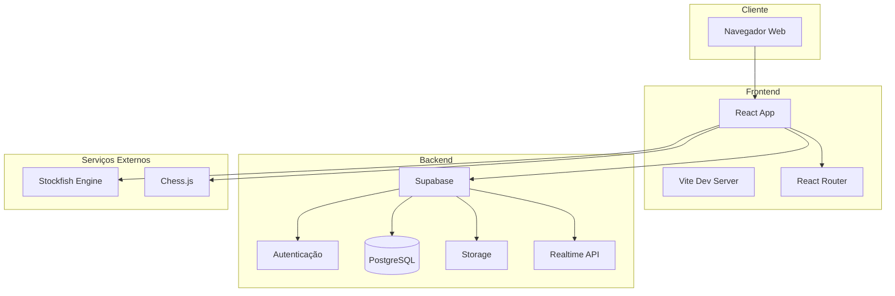
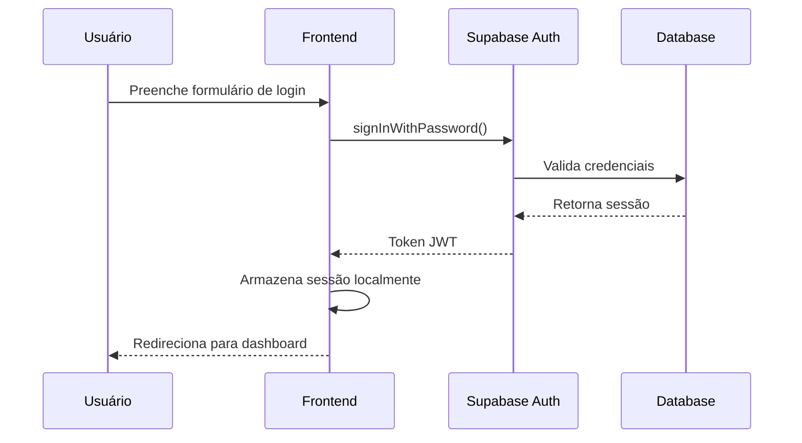
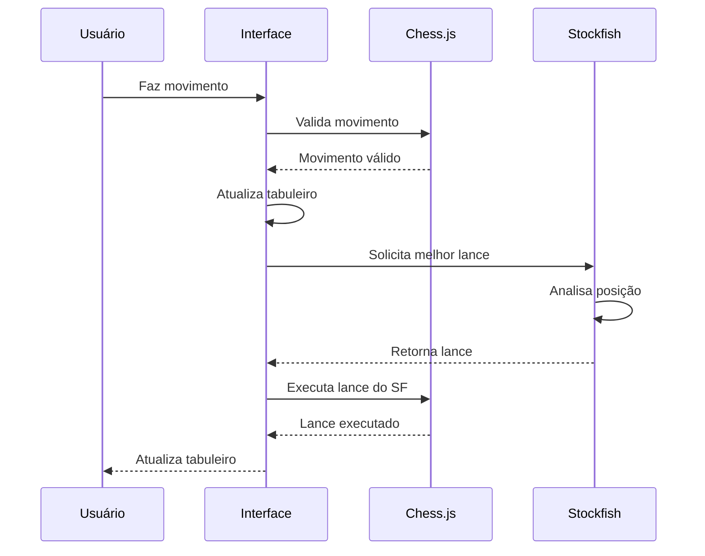

# Arquitetura - Visão Geral

## Introdução

O **OitoPorOito** segue uma arquitetura moderna de aplicação web, separando claramente as responsabilidades entre frontend, backend e banco de dados. A plataforma é projetada para ser escalável, mantível e performática.

## Diagrama de Alto Nível



## Camadas da Aplicação

### 1. Camada de Apresentação (Frontend)

**Tecnologias:**
- React 18 com Hooks
- React Router para navegação
- TailwindCSS para estilização
- Radix UI para componentes acessíveis
- Framer Motion para animações

**Responsabilidades:**
- Renderização da interface do usuário
- Gerenciamento de estado local
- Interação com o usuário
- Comunicação com APIs

### 2. Camada de Lógica de Negócio

**Implementada em:**
- Hooks customizados (`src/hooks/`)
- Utilitários (`src/utils/`)
- Serviços de integração (`src/lib/`)

**Responsabilidades:**
- Validação de movimentos de xadrez (Chess.js)
- Cálculo de lances do computador (Stockfish)
- Conversão entre formatos (FEN, PGN)
- Gerenciamento de sessão

### 3. Camada de Dados (Backend)

**Supabase fornece:**
- **Database**: PostgreSQL com Row Level Security (RLS)
- **Auth**: Autenticação de usuários
- **Storage**: Armazenamento de imagens e arquivos
- **Realtime**: Subscriptions para dados em tempo real

**Responsabilidades:**
- Persistência de dados
- Autenticação e autorização
- APIs REST automáticas
- Sincronização em tempo real

## Fluxo de Dados

### Fluxo de Autenticação



### Fluxo de Partida vs Computador



## Padrões de Projeto

### Component-Based Architecture

Todos os elementos da UI são componentes React reutilizáveis e composáveis:

```
components/
├── ChessBoard/          # Tabuleiro principal
├── Navbar/              # Navegação
├── Footer/              # Rodapé
├── ChessPuzzle/         # Puzzles
├── ChessSocial/         # Recursos sociais
└── ...
```

### Custom Hooks Pattern

Lógica reutilizável abstrada em hooks customizados:

```javascript
// Exemplo: useAuth.js
export const useAuth = () => {
  const [user, setUser] = useState(null);
  const [loading, setLoading] = useState(true);
  
  // Lógica de autenticação
  return { user, loading, signIn, signOut };
};
```

### Atomic Design

Componentes organizados em níveis de complexidade:
- **Átomos**: Botões, inputs, avatares
- **Moléculas**: Cards, form groups
- **Organismos**: Navbar, footer, board
- **Templates**: Layouts de páginas
- **Páginas**: Views completas

## Segurança

### Frontend
- Validação de inputs
- Sanitização de dados de usuário
- Proteção contra XSS
- HTTPS obrigatório

### Backend (Supabase)
- Row Level Security (RLS)
- Autenticação baseada em JWT
- Políticas de acesso por usuário
- Rate limiting

## Performance

### Otimizações Frontend
- Code splitting com React.lazy()
- Lazy loading de componentes
- Memoization com React.memo
- Debouncing em buscas
- Virtual scrolling para listas grandes

### Otimizações Backend
- Indexação de queries no PostgreSQL
- Cache de queries frequentes
- Pooling de conexões
- CDN para assets estáticos

## Escalabilidade

A arquitetura permite escalar horizontalmente:

1. **Frontend**: Deploy em CDN (Vercel, Netlify)
2. **Backend**: Supabase escala automaticamente
3. **Database**: PostgreSQL com read replicas
4. **Assets**: CDN global

## Próximos Passos

- 📖 [Frontend Detalhado](frontend.md)
- 🔧 [Backend Detalhado](backend.md)
- 💾 [Banco de Dados](database.md)
