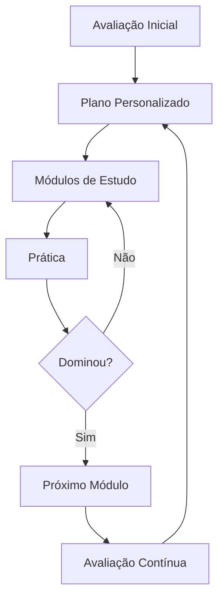

# Sistema de Aprendizado

Aprenda xadrez de forma estruturada e progressiva.

## Visão Geral

O OitoPorOito oferece um sistema completo de aprendizado adaptado ao seu nível, desde iniciante absoluto até jogador avançado.

## Como Funciona



## Trilhas de Aprendizado

### 🐣 Iniciante (0-800)

**Objetivo**: Aprender regras e conceitos básicos

#### Módulos:

1. **Regras Básicas** (1-2 horas)
   - Como as peças se movem
   - Objetivo do jogo (xeque-mate)
   - Regras especiais (roque, en passant, promoção)
   - Empate e outros resultados

2. **Tática Elementar** (2-3 horas)
   - Mate com Dama
   - Mate com Torre  
   - Proteção de peças
   - Capturas vantajosas

3. **Aberturas para Iniciantes** (1 hora)
   - Princípios de abertura
   - Desenvolvimento rápido
   - Controle do centro
   - Segurança do rei

4. **Finais Básicos** (2 horas)
   - Rei e peão vs Rei
   - Quadrado do peão
   - Oposição
   - Finais elementares

**Práticas:**
- Puzzles de mate em 1
- Partidas contra computador (nível 1-2)
- Exercises interativos

### ♟️ Básico (800-1200)

**Objetivo**: Desenvolver habilidades táticas fundamentais

#### Módulos:

1. **Táticas Fundamentais** (3-4 horas)
   - Garfo (Fork)
   - Espeto (Skewer)
   - Cravada (Pin)
   - Ataque duplo
   - Ataque descoberto

2. **Estratégia Inicial** (2 horas)
   - Peças boas vs ruins
   - Estrutura de peões
   - Casas fracas
   - Espaço e mobilidade

3. **Aberturas Sólidas** (2-3 horas)
   - Abertura Italiana
   - Defesa Francesa
   - Siciliana (ideia básica)
   - Gambito da Dama

4. **Finais de Peões** (2 horas)
   - Finais com múltiplos peões
   - Breakthroughs
   - Zugzwang
   - Rei ativo

**Práticas:**
- Puzzles 800-1200
- Partidas temáticas
- Análise de erros

### ⚔️ Intermediário (1200-1600)

**Objetivo**: Expandir repertório e melhorar cálculo

#### Módulos:

1. **Táticas Avançadas** (4-5 horas)
   - Sacrifícios de Dama
   - Desvio e afastamento
   - Sobrecarga
   - Interferência
   - Mate de corredor

2. **Planejamento Estratégico** (3-4 horas)
   - Elaboração de planos
   - Identificação de fraquezas
   - Jogo posicional
   - Profilaxia

3. **Repertório de Aberturas** (5-6 horas)
   - Escolha de abertura para Brancas
   - Repertório para Negras
   - Estruturas típicas
   - Planos de meio-jogo

4. **Técnica de Finais** (4-5 horas)
   - Torre e peão vs Torre
   - Finais de Bispos
   - Bispo vs Cavalo
   - Final de Damas

**Práticas:**
- Puzzle Rush
- Partidas longas analisadas
- Estudos de GMs

### 🏆 Avançado (1600-2000)

**Objetivo**: Refinamento e profundidade

#### Módulos:

1. **Táticas Complexas** (5-6 horas)
   - Combinações de múltiplas peças
   - Cálculo profundo (5+ lances)
   - Defesas difíceis
   - Contra-jogo

2. **Estratégia Avançada** (5-6 horas)
   - Compensação por material
   - Dinâmica vs estático
   - Jogo de Bispos opostos
   - Minoria attack

3. **Preparação de Aberturas** (8-10 horas)
   - Estudo profundo de linhas
   - Novidades teóricas
   - Preparação contra oponentes
   - Transição ao meio-jogo

4. **Finais Técnicos** (6-8 horas)
   - Finais de Dama complexos
   - Fortresses (fortalezas)
   - Finais com múltiplas peças
   - Estudos artísticos

**Práticas:**
- Análise com engine
- Partidas de torneio
- Estudo de partidas clássicas

### 👑 Mestre (2000+)

**Objetivo**: Maestria e especialização

#### Áreas de Estudo:

1. **Preparação Profissional**
   - Repertório de Grandes Mestres
   - Computer preparation
   - Psychology at the board
   - Gerenciamento de tempo

2. **Habilidades Especializadas**
   - Jogo posicional profundo
   - Ataque ao Rei
   - Endgame theory
   - Specific opening systems

**Práticas:**
- Torneios online rated
- Coaching 1-on-1
- Análise com GMs

## Formato das Lições

### 📖 Teoria

Explicações escritas com diagramas interativos:

```
┌─────────────────────────────────┐
│ 🎓 Lição: Garfo de Cavalo       │
├─────────────────────────────────┤
│                                 │
│  O Garfo ocorre quando uma      │
│  peça ataca duas ou mais peças  │
│  simultaneamente.               │
│                                 │
│  [Diagrama Interativo]          │
│                                 │
│  No exemplo, o Cavalo em d5     │
│  ataca Rei (e7) e Torre (b6).   │
│                                 │
│  ➡️ Rei deve mover              │
│  ➡️ Torre é capturada            │
│                                 │
│  [Próximo Exemplo]              │
└─────────────────────────────────┘
```

### 🎥 Vídeo-aulas

Apresentações gravadas por instrutores:

- Duração: 5-15 minutos  
- Legendas em Português
- Velocidade ajustável
- Marcações para seções

### 💻 Exercícios Interativos

Pratique o que aprendeu:

```javascript
// Exemplo: Identificar garfos
Posição 1/5
Encontre o garfo de cavalo nesta posição:

[Tabuleiro Interativo]

Tentativas: 2/3
Dica disponível: 1
```

### 📝 Questionários

Teste seu conhecimento:

- Múltipla escolha
- Verdadeiro/Falso
- Análise de posições
- Nota mínima: 70% para progredir

## Cursos Temáticos

### 🔰 Cursos Essenciais

- **Do Zero ao Xadrez**: 10 horas, gratuito
- **Táticas Básicas**: 8 horas, gratuito
- **Aberturas 101**: 12 horas, gratuito

### ⚔️ Cursos de Táticas

- **Mestria em Garfos**: 4 horas
- **Combinações Brilhantes**: 6 horas
- **Defesa Tática**: 5 horas
- **Cálculo de Variantes**: 8 horas

### 🎯 Cursos de Estratégia

- **Planejamento em Xadrez**: 6 horas
- **Estruturas de Peões**: 8 horas
- **Peças Boas e Más**: 4 horas
- **Vantagem Posicional**: 7 horas

### 📖 Cursos de Aberturas

#### Para Brancas
- **Repertório com 1.e4**: 15 horas
- **Repertório com 1.d4**: 15 horas
- **Sistemas Universais**: 10 horas

#### Para Negras
- **Defesa contra 1.e4**: 12 horas
- **Defesa contra 1.d4**: 12 horas
- **Defesas Hipermodernas**: 8 horas

### 🏁 Cursos de Finais

- **Finais de Peões**: 8 horas
- **Finais de Torres**: 10 horas
- **Finais Menores**: 6 horas
- **Finais Complexos**: 12 horas

## Sistema de Progresso

### XP e Níveis

Ganhe experiência estudando:

```
Nível 1 ────► Nível 2 ────► Nível 3
  100 XP        300 XP        600 XP
  
Ganhe XP:
✅ Completar lição: 10-50 XP
✅ Passar questionário: 20-100 XP
✅ Prática diária: 10 XP
✅ Resolver puzzles: 5-15 XP
```

### Certificados

Receba certificados ao completar cursos:

```
┌───────────────────────────────────┐
│  🏆 CERTIFICADO DE CONCLUSÃO      │
│                                   │
│  Israel Neto completou com        │
│  sucesso o curso:                 │
│                                   │
│  "Táticas Fundamentais"           │
│                                   │
│  Nota Final: 94%                  │
│  Data: 15/Janeiro/2024            │
│                                   │
│  ✓ Válido                         │
└───────────────────────────────────┘
```

### Conquistas

Desbloqueie badges especiais:

| Badge | Como Ganhar |
|-------|-------------|
| 📚 **Estudioso** | Complete 10 lições |
| 🎓 **Graduado** | Complete 1 curso |
| 🏆 **Mestre Estudante** | Complete 10 cursos |
| 🔥 **Dedicado** | Estude 7 dias seguidos |
| ⚡ **Relâmpago** | Complete curso em 1 dia |

## Análise de Desempenho

### Dashboard Personalizado

```
╔════════════════════════════════════╗
║  📊 SEU PROGRESSO DE APRENDIZADO   ║
╠════════════════════════════════════╣
║  Nível Atual:         12 ⭐        ║
║  XP:                  3,847 / 5,000║
║  Cursos Completos:    5            ║
║  Em Andamento:        2            ║
║  Tempo Total:         42h 18m      ║
║  Sequência:           9 dias 🔥    ║
╚════════════════════════════════════╝

📈 Áreas de Força:
▓▓▓▓▓▓▓▓▓░ Táticas (92%)
▓▓▓▓▓▓▓░░░ Aberturas (74%)

📉 Áreas para Melhorar:
▓▓▓▓░░░░░░ Finais (43%)
▓▓▓▓▓░░░░░ Estratégia (56%)
```

### Recomendações Personalizadas

Com base no seu desempenho:

```
💡 Próximos Passos Recomendados:

1. 🎯 Finalizar: "Estruturas de Peões" (60% completo)
2. ⚠️ Melhorar: Finais (score baixo)
3. ➡️ Começar: "Finais de Torres" (recomendado)
4. 🔄 Revisar: "Garfos e Espetos" (30 dias atrás)
```

## Integração com Prática

### Spaced Repetition

Sistema automático de revisão:

```
Você aprendeu "Mate do Pastor" há 7 dias
⏰ Hora de revisar!

[Iniciar Revisão]
```

### Aplicação Imediata

Após lições, pratique:

```
Você completou: "Garfos de Cavalo"

Pratique agora:
- 🎯 10 puzzles de garfos
- ♟️ 1 partida temática
- 📊 Quiz de garfos

[Começar Prática]
```

## Instrutores

### Equipe de Ensino

- **GM Marcus Silva** - Aberturas
- **WGM Ana Costa** - Táticas
- **FM João Santos** - Finais
- **IM Clara Oliveira** - Estratégia

### Conteúdo da Comunidade

Jogadores podem criar conteúdo:

- Enviar lições
- Gravar vídeos
- Criar quizzes
- Compartilhar estudos

!!! info "Verificado"
    Conteúdo passa por revisão antes de publicação

## Recursos Premium

### Assinatura Pro

**R$ 29,90/mês** ou **R$ 299/ano**

Inclui:
- ✅ Todos os cursos desbloqueados
- ✅ Aulas ao vivo mensais
- ✅ Análise de engine ilimitada
- ✅ Coaching 1-on-1 (1 sessão/mês)
- ✅ Comunidade exclusiva
- ✅ Certificados premium
- ✅ Sem anúncios

### Coaching Individual

Sessões privadas com instrutores:

| Instrutor | Rating | Preço/hora |
|-----------|--------|------------|
| GM Marcus Silva | 2600 | R$ 200 |
| WGM Ana Costa | 2400 | R$ 150 |
| FM João Santos | 2350 | R$ 100 |
| IM Clara Oliveira | 2450 | R$ 120 |

## Plano de Estudo Exemplo

### Jogador 1200 Rating - Meta: 1400 em 3 meses

```
Semana 1-2: Táticas Fundamentais
- Segunda/Quarta/Sexta: 1 lição (30min) + 20 puzzles
- Terça/Quinta: Partidas (2x15min) com análise
- Sábado: Revisão semanal
- Domingo: Puzzle Rush

Semana 3-4: Aberturas (Italiano para Brancas)
- Segunda/Quarta/Sexta: 1 lição abertura + 15 puzzles
- Terça/Quinta: Partidas temáticas (Italiano)
- Sábado: Quiz de abertura
- Domingo: Descanso

Semana 5-6: Finais de Peões
- Segunda/Quarta/Sexta: 1 lição finais + 15 puzzles
- Terça/Quinta: Endgame practice positions
- Sábado: Simulação de torneio
- Domingo: Análise de partidas

Semana 7-8: Estratégia Básica
- Segunda/Quarta/Sexta: 1 lição + 15 puzzles
- Terça/Quinta: Partidas longas (15+10)
- Sábado: Revisão mensal
- Domingo: Torneio online

Semana 9-12: Consolidação e Prática
- Mix de todos os tópicos
- Foco em fraquezas identificadas
- Aumento de volume de partidas
- Avaliação de progresso
```

## Dicas para Melhores Resultados

### ✅ Faça

1. **Consistência**: 30min/dia > 3h/sábado
2. **Revise**: Spaced repetition funciona
3. **Analise**: Entenda seus erros
4. **Varie**: Mix de teoria e prática
5. **Desafie-se**: Saia da zona de conforto

### ❌ Evite

1. **Pular fundamentos**: Base é crucial
2. **Apressur**: Domínio > velocidade
3. **Só teoria**: Precisa praticar
4. **Só prática**: Precisa estudar
5. **Desanimar**: Plateaus são normais

## Suporte de Aprendizado

### Comunidade de Estudantes

- 💬 Fórum de discussão
- 📹 Sessões de estudo em grupo
- 🤝 Sistema de buddy study
- 📚 Clube do livro de xadrez

### Central de Ajuda

- 📩 Email: learn@oitoporoito.com
- 💬 Chat ao vivo (Pro members)
- 📚 Knowledge base
- 🎥 FAQs em vídeo

---

**Comece sua jornada hoje:**
- [Criar Conta](creating-account.md)
- [Avaliação Inicial](overview.md)
- [Puzzles para Praticar](solving-puzzles.md)
