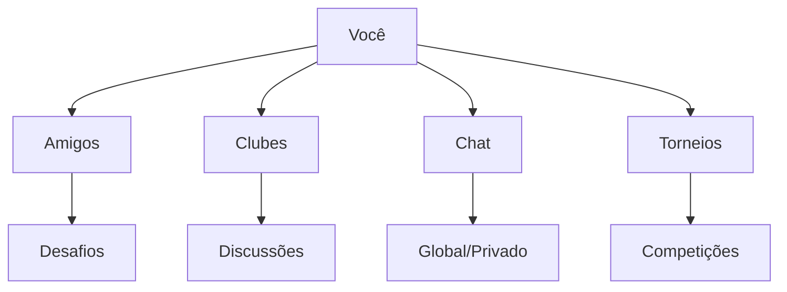

# Recursos Sociais

Conecte-se com outros jogadores e faça parte da comunidade OitoPorOito.

## Visão Geral

O xadrez é social! No OitoPorOito você pode interagir com jogadores do mundo inteiro.



## Sistema de Amizades

### Adicionar Amigos

**Como adicionar:**

1. **Via perfil**
   ```
   Perfil do Jogador → [Adicionar Amigo]
   ```

2. **Via busca**
   ```
   🔍 Buscar → Digite username → [Adicionar]
   ```

3. **Após partida**
   ```
   Fim de jogo → [Bom jogo! Adicionar amigo]
   ```

4. **Via código de amigo**
   ```
   Seu código: #OPO-1234-5678
   ```

### Gerenciar Amigos

```
┌─────────────────────────────────┐
│  👥 SEUS AMIGOS (42)            │
├─────────────────────────────────┤
│  🟢 GrandMaster2024  (2100)     │
│  │  ├─ Ver perfil               │
│  │  ├─ Desafiar                 │
│  │  ├─ Enviar mensagem          │
│  │  └─ Remover amigo            │
│                                 │
│  🔴 ChessNinja      (2050)      │
│  │  └─ Offline há 2 horas       │
│                                 │
│  🟢 TacticalMaster  (1875)      │
│     └─ Em partida agora         │
└─────────────────────────────────┘

Filtros: [Online] [Todos] [Favoritos]
Ordernar: [Rating] [Nome] [Último visto]
```

### Status de Presença

| Status | Significado |
|--------|-------------|
| 🟢 Online | Disponível para jogar |
| 🟡 Ausente | Logado mas inativo >5min |
| 🔴 Offline | Não está conectado |
| 🎮 Jogando | Em partida ativa |
| 📚 Estudando | Resolvendo puzzles/cursos |
| ⛔ Ocupado | Não quer ser interrompido |

### Notificações de Amigos

Seja notificado quando:

- ✅ Amigo entra online
- ✅ Amigo te desafia
- ✅ Amigo termina partida
- ✅ Amigo alcança novo rating

!!! tip "Dica"
    Configure notificações em Configurações → Notificações → Amigos

## Clubes

### O que são Clubes?

Grupos de jogadores com interesses comuns:

- 🏆 Competir em torneios de clube
- 💬 Discutir em fóruns privados
- 📚 Compartilhar estudos
- 🎯 Participar de eventos exclusivos

### Tipos de Clubes

#### Clubes Públicos
Qualquer um pode entrar

```
Exemplo:
📚 Clube de Estudantes
👥 1,234 membros
⭐ Rating médio: 1450
📖 Foco em aprendizado e análise
```

#### Clubes Privados
Somente por convite

```
Exemplo:
🏆 Elite Masters
👥 50 membros
⭐ Rating mínimo: 2000
🔒 Apenas por convite
```

#### Clubes Oficiais
Gerenciados pelo OitoPorOito

```
Exemplo:
🌟 Iniciantes Amigáveis
👥 5,678 membros
👶 Para jogadores <1200
✨ Monitores certificados
```

### Criar um Clube

**Passo a passo:**

1. **Navegar para Clubes**
   ```
   Menu → Social → Clubes → [Criar Clube]
   ```

2. **Preencher informações**
   ```
   Nome: Clube Tático Pro
   Descrição: Foco em táticas avançadas
   Tipo: Público / Privado
   Requisitos: Rating mínimo (opcional)
   Avatar: [Upload imagem]
   Banner: [Upload banner]
   ```

3. **Configurar regras**
   ```
   ✅ Membros podem criar topics
   ✅ Membros podem desafiar
   ❌ Somente admins podem criar torneios
   ```

4. **Publicar**
   ```
   [Criar Clube] → Revisão (se público) → Publicado!
   ```

!!! note "Limites"
    - Gratuito: 1 clube, máx 100 membros
    - Pro: 3 clubes, máx 500 membros cada

### Recursos de Clube

#### 💬 Fórum de Discussão

```
┌─────────────────────────────────────┐
│  📋 FÓRUM DO CLUBE                  │
├─────────────────────────────────────┤
│  📌 Fixado: Regras do Clube         │
│     por Admin • há 2 meses          │
│                                     │
│  🔥 Análise: Partida Nakamura       │
│     por GrandMaster2024 • 12 replies│
│     ⏰ há 2 horas                    │
│                                     │
│  💭 Qual abertura para iniciantes?  │
│     por Newbie123 • 45 replies      │
│     ⏰ há 1 dia                      │
│                                     │
│  [➕ Novo Tópico]                   │
└─────────────────────────────────────┘
```

#### 🏆 Torneios de Clube

Organize competições privadas:

- **Arena**: Todos jogam juntos, mais pontos vence
- **Swiss**: Sistema suíço
- **Round Robin**: Todos contra todos
- **Eliminatório**: Mata-mata

```
🏆 TORNEIO MENSAL - MARÇO
───────────────────────────
Formato: Arena
Duração: 2 horas
Time Control: 5+3 Blitz
Inscritos: 24/50
Premiação: 
  🥇 1º lugar: Badge + Título
  🥈 2º lugar: Badge
  🥉 3º lugar: Badge

[Inscrever-se]
```

#### 📊 Ranking do Clube

```
╔════════════════════════════════════╗
║  📊 RANKING DO CLUBE               ║
╠════════════════════════════════════╣
║  🥇 GrandMaster2024    2100 ⭐     ║
║  🥈 TacticalMaster     2050 ⭐     ║
║  🥉 ChessNinja         2020 ⭐     ║
║  4️⃣ Israel Neto        1847 ⭐     ║
║  5️⃣ BeginnerPro        1820 ⭐     ║
╚════════════════════════════════════╝

Ver completo: [50 membros]
```

#### 📚 Biblioteca do Clube

Compartilhe recursos:

- 📄 Artigos salvos
- 🎥 Vídeos recomendados
- ♟️ PGNs de partidas interessantes
- 📘 Estudos de abertura
- 🎯 Coleções de puzzles

#### 📅 Eventos

```
📅 PRÓXIMOS EVENTOS

🗓️ 15 Mai - Torneio Mensal
   Arena 2h, 5+3 Blitz

🗓️ 20 Mai - Aula ao Vivo
   "Defesa Francesa", por GM Silva

🗓️ 25 Mai - Simulada simultânea
   FM João Santos vs 10 membros

[Ver Calendário Completo]
```

### Permissões de Clube

| Papel | Permissões |
|-------|------------|
| **Dono** | Todas as permissões |
| **Admin** | Gerenciar membros, criar torneios, moderação |
| **Moderador** | Moderar fórum, chat |
| **Membro** | Participar, postar no fórum |

## Sistema de Chat

### Chat Global

Canal público para todos:

```
┌─────────────────────────────────────┐
│  🌍 CHAT GLOBAL                     │
├─────────────────────────────────────┤
│  GrandMaster2024: Alguém quer jogar?│
│  TacticalMaster: Qual seu rating?   │
│  GrandMaster2024: 2100 blitz        │
│  ChessNinja: Te desafio! 5+3?       │
│  GrandMaster2024: Bora! /challenge  │
│                                     │
│  [Digite sua mensagem...]           │
└─────────────────────────────────────┘

👥 256 online agora
```

### Chat Privado

Mensagens diretas com amigos:

```
┌─────────────────────────────────────┐
│  💬 ChessNinja                      │
├─────────────────────────────────────┤
│  Você: Boa partida! Aquele garfo   │
│  no final foi brutal 😅             │
│  ⏰ 14:32                            │
│                                     │
│  ChessNinja: Valeu! Quase não vi   │
│  Quer revanche?                     │
│  ⏰ 14:35                            │
│                                     │
│  [Digite sua mensagem...]           │
└─────────────────────────────────────┘
```

### Comandos de Chat

| Comando | Ação |
|---------|------|
| `/challenge @user` | Desafiar usuário |
| `/rating` | Ver seu rating |
| `/online` | Amigos online |
| `/busy` | Marcar como ocupado |
| `/help` | Lista de comandos |
| `/block @user` | Bloquear usuário |
| `/report @user` | Reportar comportamento |

### Moderação

Mantenha ambiente saudável:

- ⚠️ Sistema automático detecta linguagem inadequada
- 🚫 Timeout temporário para infrações leves
- 🔨 Ban permanente para infrações graves
- 📝 Histórico de moderação é registrado

## Perfil Público

### Seu Perfil

O que outros vêem:

```
┌─────────────────────────────────────────┐
│  [@IsraelNeto]                          │
│  🖼️ [Avatar]        Israel Neto         │
│                    🇧🇷 Brasil            │
│                    ⭐ 1847               │
│                                         │
│  📊 ESTATÍSTICAS                        │
│  ├─ Partidas: 1,284                     │
│  ├─ Vitórias: 687 (53.5%)               │
│  ├─ Puzzles: 2,145 resolvidos           │
│  └─ Membro desde: Jan 2024              │
│                                         │
│  🏆 CONQUISTAS (12)                     │
│  🔥 ⚡ 🎯 🌟 📚 ...                     │
│                                         │
│  📝 BIO                                 │
│  Entusiasta de xadrez! Adoro táticas   │
│  e Defesa Francesa. Sempre procurando  │
│  melhorar. Bora jogar!                  │
│                                         │
│  [➕ Adicionar Amigo] [💬 Mensagem]    │
│  [⚔️ Desafiar]                          │
└─────────────────────────────────────────┘
```

### Personalização

Configure seu perfil:

1. **Avatar**
   - Upload de imagem (máx 2MB)
   - Recorte automático (quadrado)
   - Avatars temáticos premium

2. **Banner**
   - Imagem de fundo (Pro members)
   - Galeria de banners

3. **Bio**
   - Máximo 200 caracteres
   - Mentions permitidos
   - Emojis suportados

4. **Badges**
   - Escolha até 3 para exibir
   - Ordenação livre

5. **Privacidade**
   ```
   ✅ Mostrar rating
   ✅ Mostrar estatísticas
   ✅ Permitir mensagens de não-amigos
   ❌ Mostrar país
   ❌ Mostrar última vez online
   ```

## Atividade Social

### Feed de Atividades

Veja o que amigos estão fazendo:

```
┌─────────────────────────────────────────┐
│  📰 FEED DE ATIVIDADES                  │
├─────────────────────────────────────────┤
│  🏆 GrandMaster2024 venceu torneio      │
│     "Arena Blitz Sábado"                │
│     ⏰ há 2 horas                        │
│     [Ver Resultados]                    │
│                                         │
│  ⭐ ChessNinja alcançou 2100 rating!    │
│     ⏰ há 5 horas                        │
│     💬 15 parabéns                       │
│                                         │
│  🎯 TacticalMaster resolveu puzzle      │
│     rating 2400                         │
│     ⏰ há 1 dia                          │
│                                         │
│  📚 IsraelNeto completou curso          │
│     "Táticas Avançadas"                 │
│     ⏰ há 2 dias                         │
│     🎓 Certificado obtido                │
└─────────────────────────────────────────┘
```

### Compartilhamento

Compartilhe suas conquistas:

- 🏆 Vitórias importantes
- 🎯 Puzzles difíceis resolvidos
- 📚 Cursos completados
- ⭐ Novos ratings alcançados
- 🏅 Badges desbloqueados

```
Compartilhar partida:
┌─────────────────────────────────┐
│  🎮 Que partida épica!          │
│                                 │
│  Israel Neto [1847] 1-0         │
│  ChessNinja [2020]              │
│                                 │
│  Sacrifiquei a Dama e dei mate! │
│                                 │
│  [Ver Partida] [Análise]        │
│                                 │
│  #tática #sacrifício #épico     │
└─────────────────────────────────┘

[Compartilhar] [Cancelar]
```

## Torneios Sociais

### Tipos de Torneios

#### 🏆 Torneios Públicos
Organize compete com todos:

```
🏆 TORNEIO ABERTO DE DOMINGO
───────────────────────────
Organizador: OitoPorOito
Formato: Arena
Duração: 3 horas
Time Control: 3+2 Blitz
Inscritos: 1,456 / ilimitado
Premiação: Badges + Títulos

[Inscrever-se Grátis]
```

#### 🎖️ Torneios Premium
Maiores prêmios (Pro members):

```
💎 TORNEIO PREMIUM - MENSAL
───────────────────────────
Formato: Swiss (7 rodadas)
Time Control: 10+5 Rapid
Inscritos: 128 / 128 (CHEIO)
Premiação: 
  🥇 R$ 500 + Badge exclusivo
  🥈 R$ 300
  🥉 R$ 200

[Lista de Espera]
```

#### 👥 Torneios de Clube
Apenas membros:

```
⚔️ CAMPEONATO INTERNO
───────────────────────────
Clube: Táticos Pro
Formato: Round Robin
Inscritos: 16 / 20
Somente membros podem participar

[Inscrever-se]
```

### Criar Torneio (Pro)

```
Configurações do Torneio:
────────────────────────
Nome: Meu Torneio Especial
Tipo: Arena / Swiss / Eliminatório
Time Control: Escolha...
Duração: 1-12 horas
Data/Hora: Agendar
Rating: Mínimo/Máximo (opcional)
Máx Jogadores: 10-1000
Taxa de Inscrição: Grátis / Pago
Premiação: Descreva...

[Criar Torneio - R$ 10]
```

## Sistema de Reputação

### Como Funciona

Ganhe pontos de reputação:

| Ação | Reputação |
|------|-----------|
| Receber "Bom Jogo" | +1 |
| Post útil no fórum | +5 |
| Ajudar iniciante | +10 |
| Organizar torneio | +25 |
| Contribuir conteúdo aprovado | +50 |

### Níveis de Reputação

```
🌱 Novato (0-50)
🌿 Membro (51-200)
🌳 Veterano (201-500)
⭐ Ilustre (501-1000)
👑 Lenda (1000+)
```

### Benefícios

- 🎖️ Badge especial no perfil
- 💬 Prioridade no suporte
- 🏆 Acesso a eventos exclusivos
- 🎁 Descontos em Pro

## Transmissões ao Vivo

### Assistir Streams

```
┌─────────────────────────────────────┐
│  🔴 AO VIVO AGORA                   │
├─────────────────────────────────────┤
│  🎥 GM Marcus Silva                 │
│     "Análise de Partidas GM"        │
│     👁️ 1,234 assistindo              │
│     [Assistir]                      │
│                                     │
│  🎮 TacticalMaster                  │
│     "Speedrun 1000→2000"            │
│     👁️ 567 assistindo                │
│     [Assistir]                      │
└─────────────────────────────────────┘
```

### Fazer Stream (Pro)

Requisitos:
- ✅ Conta Pro ativa
- ✅ Rating mínimo 1400
- ✅ Sem infrações de conduta

Recursos:
- 🎥 Streaming integrado
- 💬 Chat com moderação
- 📊 Análise em tempo real
- 🎬 VODs salvos automaticamente

## Privacidade e Segurança

### Configurações de Privacidade

```
🔒 PRIVACIDADE
─────────────
👤 Perfil:
   ◉ Público   ○ Amigos   ○ Privado

📊 Estatísticas:
   ☑ Mostrar rating
   ☑ Mostrar histórico de partidas
   ☐ Mostrar puzzles resolvidos

💬 Mensagens:
   ◉ Todos   ○ Amigos   ○ Ninguém

📍 Localização:
   ☐ Mostrar país
   ☐ Mostrar cidade

🕐 Status Online:
   ☑ Mostrar quando online
   ☐ Mostrar última vez online
```

### Bloqueio e Reporte

**Bloquear usuário:**
```
Perfil → [...] → Bloquear

O que acontece:
❌ Não podem te desafiar
❌ Não veem seu profile
❌ Não podem te mensagear
❌ Não aparecem em matchmaking
```

**Reportar comportamento:**
```
Perfil → [...] → Reportar

Motivos:
⚠️ Linguagem ofensiva
⚠️ Spam
⚠️ Trapaça
⚠️ Assédio
⚠️ Outro

Equipe revisa em 24-48 horas
```

## Recursos Móveis

Todo conteúdo social no mobile:

- 📱 Notificações push
- 💬 Chat tempo real
- 👥 Lista de amigos
- 🏆 Torneios
- 📰 Feed de atividades

Download:
- 🍎 [App Store](https://apps.apple.com/oitoporoito)
- 🤖 [Google Play](https://play.google.com/oitoporoito)

---

**Conecte-se agora:**
- [Buscar Jogadores](overview.md)
- [Explorar Clubes](overview.md)
- [Ver Torneios](../resources/faq.md)
- [Configurações de Privacidade](creating-account.md)
