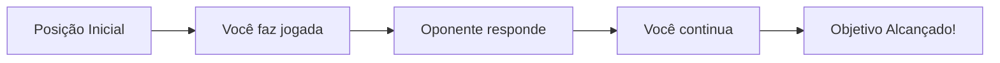
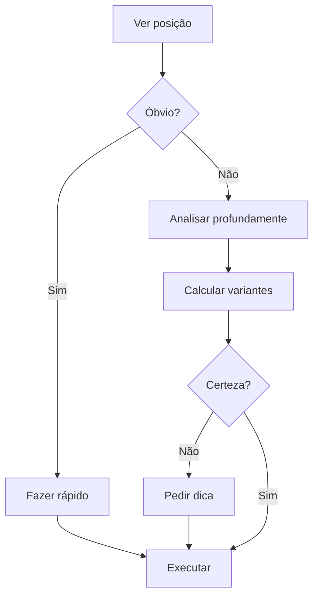
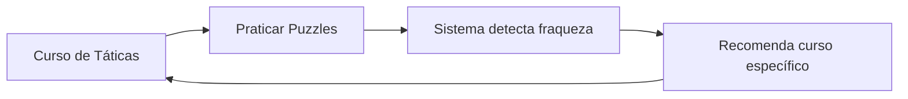

# Resolvendo Puzzles

Aprenda a resolver puzzles de xadrez e melhore suas habilidades táticas.

## O que são Puzzles?

Puzzles de xadrez são posições específicas onde você precisa encontrar a **melhor sequência de movimentos** para alcançar um objetivo (geralmente ganhar material, dar xeque-mate, ou conquistar vantagem decisiva).



## Como Funcionam

### Tipos de Puzzles

#### 1. 🎯 Mate em N
Encontre sequência de xeque-mate forçado

```
Exemplo: Mate em 2
8/8/8/8/8/2k5/1Q6/K7 w - - 0 1

Solução: 1. Qb3+ Kd2 2. Qd1#
```

#### 2. ⚔️ Ganhar Material
Capture peças do oponente com vantagem

```
Exemplo: Ganhe a Dama
r1bqkb1r/pppp1ppp/2n2n2/4p3/2B1P3/5N2/PPPP1PPP/RNBQK2R w KQkq - 0 1

Solução: 1. Bxf7+ (garfo real, ganha Dama)
```

#### 3. 🛡️ Defesa
Encontre a única jogada defensiva

``` 
Oponente ameaça mate, você precisa defender
```

#### 4. 📈 Vantagem Posicional
Obtenha vantagem estratégica (controle de centro, peça má posicionada, etc.)

## Interface de Puzzles

### Layout

```
┌─────────────────────────────────┐
│  ⭐ Rating: 1842   📊 Tentativas │
├─────────────────────────────────┤
│                                 │
│       [Tabuleiro 8x8]           │
│                                 │
├─────────────────────────────────┤
│  🎯 Objetivo: Mate em 2         │
│  ⚡ Bônus: Resolver < 30s       │
├─────────────────────────────────┤
│  [Desistir]  [Dica]  [Resolver] │
└─────────────────────────────────┘
```

### Controles

| Ação | Como Fazer |
|------|------------|
| **Mover peça** | Arrastar ou clicar origem→destino |
| **Voltar jogada** | Botão "Undo" ou Ctrl+Z |
| **Pedir dica** | Botão "Dica" (máx 2 por puzzle) |
| **Desistir** | Ver solução completa |
| **Próximo puzzle** | Após resolver, próximo automático |

## Sistema de Rating

### Como Funciona

Puzzles e jogadores têm rating:

```
Rating do Puzzle: 1850
Seu Rating: 1600

Você resolve: +16 pontos
Você erra: -8 pontos
```

**Fatores:**
- Diferença de rating entre você e o puzzle
- Tempo para resolver (bônus se rápido)
- Tentativas (penalidade após 3 erros)

### Faixas de Rating

| Rating | Nível | Descrição |
|--------|-------|-----------|
| 0-1000 | Iniciante | Mates básicos, capturas simples |
| 1000-1400 | Básico | Garfos, espetos, cravadas |
| 1400-1800 | Intermediário | Combinações de 2-3 lances |
| 1800-2200 | Avançado | Sacrifícios, táticas complexas |
| 2200+ | Mestre | Puzzles de partidas GM |

## Estratégias para Resolver

### 1. 📋 Checklist Mental

Sempre verifique na sequência:

```
1. ✅ Há xeques disponíveis?
2. ✅ Há capturas forçadas?
3. ✅ Há ameaças de mate?
4. ✅ Peças desprotegidas do oponente?
5. ✅ Posso criar garfo/espeto/cravada?
```

### 2. 🧠 Padrões Táticos Comuns

#### Garfo (Fork)
Uma peça ataca duas ou mais peças simultaneamente

```
♘ Cavalo em f7 ataca ♚ Rei em e8 e ♛ Dama em h8
```

#### Espeto (Skewer)
Ataque linear forçando peça valiosa a sair, expondo outra

```
♗ Bispo ataca ♚ Rei → Rei move → Bispo captura ♛ Dama atrás
```

#### Cravada (Pin)
Peça não pode mover sem expor peça mais valiosa

```
♖ Torre craven ♞ Cavalo ao ♚ Rei → Cavalo não pode sair
```

#### Mate do Corredor (Back Rank Mate)
Rei preso na primeira fileira sendo atacado

```
♖ Torre dá mate na 8ª fileira, rei bloqueado por próprios peões
```

### 3. ⏱️ Gestão de Tempo



**Tempo recomendado:**
- Puzzle fácil: 30-60 segundos
- Puzzle médio: 1-3 minutos
- Puzzle difícil: 3-10 minutos

### 4. 💡 Usando Dicas Efetivamente

**Dica 1**: Indica tipo de tática (garfo, mate, etc.)
```
💡 "Procure por um garfo de cavalo"
```

**Dica 2**: Mostra peça a mover
```
💡 "A solução começa com o Cavalo em g5"
```

**Dica 3**: Mostra primeiro movimento
```
💡 "1. Nxf7+ é o movimento correto"
```

!!! warning "Penalidades"
    - Primeira dica: -10% pontos
    - Segunda dica: -25% pontos
    - Terceira dica: -50% pontos

## Modos de Jogo

### 🎲 Puzzle Rush

Resolva o máximo de puzzles em 5 minutos!

**Regras:**
- Começa fácil e fica mais difícil
- 3 vidas (3 erros = fim)
- Sem dicas
- Combos aumentam pontos

```
Combo: ○○○○○  (5 seguidos = 2x pontos!)
Vidas:  ❤️❤️❤️
Tempo: 4:32
Score: 285 pontos
```

### 📊 Puzzle Battle

Compete contra outro jogador!

**Como funciona:**
1. Ambos recebem mesmo puzzle
2. Primeiro a resolver ganha ponto
3. Melhor de 5 puzzles
4. Rating de ambos ajustado

### 🎯 Themed Puzzles

Pratica táticas específicas:

- **Opening Traps**: Armadilhas nas aberturas
- **Middlegame Tactics**: Táticas de meio-jogo
- **Endgame Studies**: Finais técnicos
- **Sacrifices**: Sacrifícios brilhantes
- **Defense**: Defesas difíceis

### 📚 Puzzle Sets

Coleções curadas:

- **GM Games**: De partidas de Grandes Mestres
- **World Championships**: Campeonatos mundiais
- **Classics**: Puzzles históricos famosos
- **Player Styles**: Tal, Kasparov, Fischer, etc.

## Progresso e Estatísticas

### Dashboard

```
╔══════════════════════════════════════╗
║  📊 SEU PROGRESSO EM PUZZLES         ║
╠══════════════════════════════════════╣
║  Rating Atual:        1847 ⭐        ║
║  Maior Rating:        1923           ║
║  Resolvidos:          1,284          ║
║  Taxa de Acerto:      76.3%          ║
║  Sequência Atual:     12 dias 🔥     ║
║  Tempo Médio:         1m 23s         ║
╚══════════════════════════════════════╝
```

### Gráficos

**Rating ao longo do tempo:**
```
1900 ┤        ╭─╮
1850 ┤    ╭───╯ ╰─╮
1800 ┤  ╭─╯       ╰╮
1750 ┤╭─╯          ╰─
     └──────────────────
     Jan  Fev  Mar  Abr
```

**Performance por tema:**
```
Garfos:      ████████░░ 82%
Espetos:     ██████░░░░ 64%
Cravadas:    ███████░░░ 71%
Mates:       █████████░ 89%
Defesas:     ████░░░░░░ 45%
```

## Conquistas

Desbloqueie badges especiais:

| Badge | Requisito | Recompensa |
|-------|-----------|------------|
| 🌟 **Iniciante** | Resolva 10 puzzles | +50 XP |
| 🔥 **Sequência** | 7 dias seguidos | +100 XP |
| ⚡ **Velocista** | Resolva em <10s | +25 XP |
| 🎯 **Perfeito** | 50 seguidos certos | +500 XP |
| 🏆 **Mestre Tático** | Rating 2000+ | Título especial |

## Dicas para Melhorar

### Para Iniciantes

1. **Comece fácil**: Faça puzzles abaixo do seu rating
2. **Aprenda padrões**: Estude garfos, cravadas, espetos
3. **Sem pressa**: Priorize precisão sobre velocidade
4. **Revise erros**: Entenda por que errou

### Para Intermediários

1. **Calcule variantes**: Pense 3-4 lances adiante
2. **Candidate moves**: Liste todas as jogadas possíveis
3. **Visualização**: Pratique ver posições mentalmente
4. **Temas específicos**: Foque em fraquezas

### Para Avançados

1. **Puzzle Rush**: Treine velocidade de cálculo
2. **Estudos de GMs**: Analise puzzles complexos
3. **Sem dicas**: Nunca use, mesmo difícil
4. **Competição**: Puzzle Battle contra forte oponentes

## Problemas Comuns

### "Não consigo resolver nenhum"

✅ **Solução**: Reduza dificuldade temporariamente
- Vá para puzzles 200-300 pontos abaixo do rating
- Estude táticas básicas primeiro
- Use dicas sem vergonha inicialmente

### "Resolvo mas demoro muito"

✅ **Solução**: Pratique pattern recognition
- Faça mesmos temas repetidamente
- Puzzle Rush para treinar velocidade
- Memorize posições comuns

### "Acerto mas não entendo"

✅ **Solução**: Estude a solução completa
- Leia explicação fornecida
- Analise com engine depois
- Veja variantes alternativas

### "Rating parou de crescer"

✅ **Solução**: Varie seu treino
- Tente temas diferentes
- Misture fácil e difícil
- Faça pausas (plateaus são normais)

## Recursos de Aprendizado

### No Site

- 📹 **Vídeo-aulas**: Explicações de táticas comuns
- 📚 **Artigos**: Guias escritos detalhados
- 🎓 **Cursos**: Programas estruturados por nível

### Externos

- [Chess Tactics for Beginners](https://www.chess.com/lessons)
- [Lichess Puzzle Guide](https://lichess.org/training)
- [ChessTempo](https://chesstempo.com) - Mais puzzles

## Integração com Aprendizado

Puzzles são integrados ao sistema de aprendizado:



Veja mais em [Aprendizado](learning.md).

## FAQ

**P: quantos puzzles devo fazer por dia?**  
R: 10-20 é ideal. Qualidade > quantidade.

**P: É melhor fazer rápido ou devagar?**  
R: Depende do objetivo. Para aprender: devagar. Para Rating Rush: rápido.

**P: Devo usar Engine depois?**  
R: Sim! Análise pós-puzzle é ótima para aprender.

**P: Por que meu rating de puzzles é maior que de partidas?**  
R: Normal! Puzzles têm solução garantida, partidas não.

**P: Posso criar meus próprios puzzles?**  
R: Sim! Vá para "Criar Puzzle" e envie para revisão da comunidade.

---

**Próximos Passos:**
- [Jogar Partidas](playing-games.md)
- [Sistema de Aprendizado](learning.md)
- [Analisar Partidas](../development/components/overview.md)
